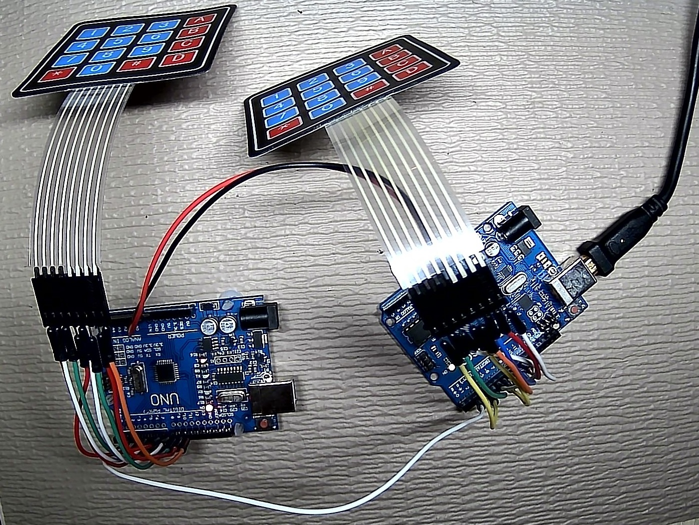

This project involves using a SoftwareSerial connection from pin 2 of two different Unos to send data from one MCU to the other. Each MCU is set up with a different 4x4 matrix keypad to illustrate how the data can be handled.

The "MASTER" MCU is the MCU that's receiving the data from the SLAVE, and sending it along to the regular Serial Monitor, as well as its own data.

For this example, rather than dedicate a RX and TX pin for the Software Serial connection, half-libraries are used since data is only being sent one way. The libraries used here are:

  SoftwareSerialIn.h v1.0 by Joe Beuckman, available at: https://github.com/jbeuckm/SoftwareSerialIn 
SendOnlySoftwareSerial.h v1.0 by Nick Gammon, available at: https://github.com/nickgammon/SendOnlySoftwareSerial

The MASTER MCU is powered through USB. The SLAVE MCU is powered parasitically from the master (Vin - Vin, GND - GND). That way there only needs to be one connection to the computer.

However, the slave.ino sketch will need to be uploaded to the SLAVE MCU through USB first.
  
  
